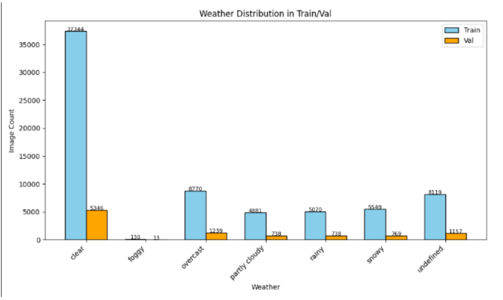

## BDD-Object-Detection: Assignment
This assignment aims to study the BDD 100k Dataset for Object Detection classes and run a round of training over the dataset.  

# BDD100K Dataset Analysis
This work provides an in-depth analysis of the **BDD100K** dataset, focusing on various factors available in the data annotations like class, scene, time of day, and weather distributions. The goal is to understand the data distribution and characteristics that may influence training and model generalization.

---

## 📊 1. Class Distribution
This dataset contains a total of 70,000 train images and 10,000 val images. The distribution is across 12 classes - bike, bus, car, drivable_area, lane, motor, person, rider, traffic_light, traffic_sign, train, truck. Out of these two classes belong to semantic segmentation - drivable_area and lane. So we consider the remaining 10 classes for our performance analysis. 

### Combined Train and Validation Sets

- **Dominant Classes**:  
  `car`, `lane`, and `drivable area` appear most frequently in the dataset, with `car` appearing in over 70% of samples.
  
- **Underrepresented Classes**:  
  `train`, `motor`, `bike`, and `rider` are severely underrepresented, often with less than 1% presence.

- **Observation**:  
  The extreme skew towards common classes indicates a **long-tail distribution**, which can cause significant performance drop for rare class predictions.

- **Train/Val split**:
  If we observe the train/val split of the current set, `person` class is totally under-represented in the train set and significantly present in the val set.
  This can lead to wrong validation over the concerned class as there is lacking training data, but significant presence in validation set.

  The train/val split across classes is uneven.  
  1. bike -  84:16
  2. bus - 90:10
  3. car - 87:13
  4. motor - 84:16
  5. person - 13:87
  6. rider - 69:31
  7. traffic_light - 74:26
  8. traffic_sign - 63:37
  9. train - 75:25
  10. truck - 90:10
 
  The above distribution should have similar numbers across all classes, ideally a split of 70:30 or 80:20.  

---

## 🧠 Class Imbalance: Detailed Analysis

- **Challenges Imposed**:  
  - Models tend to bias predictions toward frequent classes.  
  - Rare classes may have high false negative rates.  
  - Evaluation metrics (like mAP in object detection case) can be misleading if dominated by frequent classes.  

- **Mitigation Strategies**:  
  - **Class-aware sampling**: Oversample rare classes or undersample dominant ones during training.  
  - **Loss weighting**: Use inverse frequency or log-frequency class weights in the loss function (e.g., in CrossEntropy or Focal Loss).  
  - **Focal Loss**: Helps the model focus more on hard, misclassified examples.  
  - **Data augmentation**: Apply augmentations only to rare classes (copy-paste, GANs, etc.).  
  - **Synthetic data generation**: Create synthetic examples of rare classes using domain randomization or simulation.  
  - **Two-stage detectors**: First stage detects common objects; second stage focuses on hard or rare classes.  

---

## 🏙️ 2. Scene Type Distribution

- **Most Common**: `city street` scenes dominate the dataset.  
- **Rare Scenes**: `tunnel`, `parking lot`, and `gas stations` occur infrequently.   

- **Implication**:  
  Models may overfit to urban driving scenarios. Specialized tuning or few-shot learning methods might help improve rare scene recognition.    

---

## 🌅 3. Time of Day Distribution
  

- **Distribution**:
  - `daytime`: Majority of images.    
  - `night`: Moderately represented.  
  - `dawn/dusk` and `undefined`: Rare.  

- **Impact**:
  - Models trained primarily on daytime images may struggle in night or dawn/dusk conditions.  
  - We could consider using image enhancement or nighttime-specific models if deployment involves varied lighting.    

---

## 🌦️ 4. Weather Distribution

- **Dominated by**: `clear` weather.
- **Underrepresented**: `foggy`, `snowy`, and `rainy` conditions.  

- **Implication**:  
  The dataset may not adequately prepare models for real-world deployment under poor weather conditions.  

- **Remedies**:
  - Include more diverse weather conditions using simulation   
  - Weather augmentation (e.g., fog and rain overlays).   
  - Domain adaptation from synthetic-to-real weather.  
  
---

### Data Analysis code   
#### Docker Setup
Please clone the repository on your system and build the docker image using the Dockerfile provided with this repository.    
The Dockerfile provides environment for Data Analysis, Model training and evaluation, and dashboarding.    
`docker build -t bdd100k_image_divya .`   
`docker run -it -p 8501 -v $(pwd):/bosch_od --gpus all --name bdd100k_divya_container bdd100k_image_divya /bin/bash`   

Make sure to place train and val labels json files at `/bosch_od/bosch/data/labels/bdd100k_train.json` and `/bosch_od/bosch/data/labels/bdd100k_val.json`   

- Run `scripts/data_processing/data_analysis.py` to save analysis results to disk.       
- Run `cd scripts/data_processing && streamlit run dashboard.py --server.address 0.0.0.0 --server.port 8501` to visualize the data on a dashboard.   

Here are some screenshots of the Dashboard as it runs on your localhost   
    

## Model Selection - Yolov8/Yolov11 - Reasoning    
### 🧠 Why YOLOv8 for Object Detection?  

For this BDD100K object detection project, we selected **YOLOv8 (You Only Look Once version 8)** as the model of choice. It balances between **speed**, **accuracy**, **deployment readiness**, and **ease of use**. YOLOv8 also introduces architectural improvements over previous YOLO versions, making it ideal for large-scale traffic scene understanding tasks.   

This project also experiments with **Yolov11** for a comparison over the BDD100k validation set. Although the differences observed in performance are not huge, but it could be immensely different with an improved data distribution as noted in above sections.

---

### ✅ Key Advantages of YOLOv8  

- **Real-time inference** (30–60 FPS on modern GPUs, 15+ FPS on edge devices)  
- **High accuracy** on small and occluded objects (common in BDD100K)  
- **Modular architecture** with support for detection, segmentation, classification  
- **Built-in tools**: AutoAnchor tuning, augmentation, visualization, logging  
- **Easy deployment**: Export to ONNX, TensorRT, TFLite, CoreML  
- **Large community** and Ultralytics support for quick debugging and updates   

---

### Architecture Comparison: YOLOv8 vs DETR / Transformer Detectors  

| Feature | **YOLOv8** | **DETR / DINO / Transformer-based** |  
|--------|------------|--------------------------------------|  
| **Backbone** | CSPDarknet, C2f blocks, lightweight ConvNets | ResNet-50, Swin, ViT, or other transformers |    
| **Neck** | PAN-FPN or BiFPN-like structure for feature fusion | No neck (or simple projection heads) |   
| **Head** | Decoupled classification and regression heads | Transformer decoder layers + FFN |   
| **Detection strategy** | Anchor-free dense prediction with NMS | Set-based matching with Hungarian loss |   
| **Positional encoding** | Implicit via spatial conv layers | Explicit 2D positional encodings |   
| **Training time** | Fast (~6–12 hrs for large datasets) | Long (~24–72 hrs or more) |   
| **Data requirements** | Efficient even with medium data | Requires large datasets and epochs to converge |   
| **Inference speed** | Real-time, optimized | Slow (~3–10 FPS on GPU) |   
| **Object count limitation** | Dynamic with NMS | Fixed-size (e.g., 100 predictions per image) |   
| **Output stability** | High consistency | Output can fluctuate with small input shifts |   
| **Deployment** | Easy (ONNX, TensorRT, CoreML) | Complex due to attention layers, dependencies |   

---

While transformer-based models like **DETR** and **DINO** are excellent for high-resource setups, yolov8/yolov11 has much **faster inference speed**, **simple training pipeline**, and **easy deployment setup** which makes it **more suitable** for large-scale real-time applications like BDD100K driving datasets. 

---

### ✅ Final Decision: YOLOv8

Given the BDD100K dataset's:
- **Large image variety and class imbalance**
- **Need for real-time predictions for deployment on edge devices**
- **Multiple small, occluded, and overlapping objects**

---   

## Model Training - Yolov8/Yolov11  
Setting up training for Yolov8/Yolov11 includes two major steps:  
- preparing data and annotations from BDD to Yolo format - run script at `bosch/scripts/data_processing/convert_to_yolo.py`
- Run training script at `bosch/scripts/data_processing/train.py`

Here's a screenshot of the training initiated after data preparation for this project - 
  

This training was initiated on 2GPUs - availing DDP - Data Distributed Parallel training from Ultralytics pipeline.

## ✅ Summary & Recommendations

- Significant **class and condition imbalance** exists in BDD100K.    
- Bias toward **urban, clear, daytime conditions** may limit model generalization.    
- Performance on **rare classes and conditions** may be low without countermeasures.      

### 📌 Recommendations

- Apply **class-aware loss functions** and sampling strategies.  
- Use **augmentation and synthetic data** to improve representation of rare scenarios.   
- Evaluate models with **per-class and per-condition metrics**, not just overall accuracy.   
- Consider building a **balanced validation subset** for fair evaluation.   

--- 

